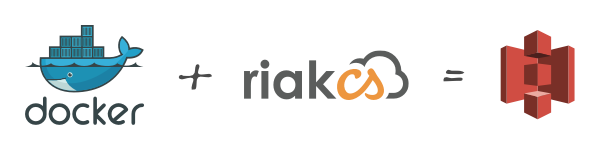
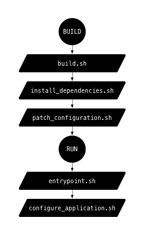

# Docker Riak CS

<div align="center"></div>

[Riak CS](http://docs.basho.com/riakcs/latest/) is an object storage software [compatible](http://docs.basho.com/riakcs/latest/references/apis/storage/s3/) with [AWS S3](http://aws.amazon.com/s3/) API. It's a perfect S3 alternative for local development and testing, which is the exact purpose of this image. It works as a single node to keep the resources to the minimum, something that [Riak guys wouldn't recommend](http://basho.com/why-your-riak-cluster-should-have-at-least-five-nodes/) and certainly not suitable for production. There is [hectcastro/docker-riak-cs](https://github.com/hectcastro/docker-riak-cs) project that allows to bring up a multi-node cluster, which might suite you better.

[](https://circleci.com/gh/ianbytchek/docker-riak-cs)

## Running

Pull or build the image yourself and run it. When the container gets started it will setup the Riak admin and show you the credentials. Will also create optionally provided buckets.

```sh

# Pull…
docker pull 'ianbytchek/riak-cs'

# Or build…
docker build --tag 'ianbytchek/riak-cs' './src'
 
# Run and create three buckets.
docker run --detach \
    --env 'RIAK_CS_BUCKETS=foo,bar,baz' \
    --publish '8080:8080' \
    --name 'riak-cs' \
    ianbytchek/riak-cs

# Configure s3cmd, `RIAK_CS_KEY_ACCESS` and `RIAK_CS_KEY_SECRET` are printed to
# stdout, run `docker logs -f 'riak-cs'` to see what they are. Also make sure to
# use the correct `proxy_host` if you are on Mac / running docker inside a vm.

cat <<EOF >~/.s3cfg.riak_cs
[default]
access_key = <RIAK_CS_KEY_ACCESS>
host_base = s3.amazonaws.dev
host_bucket = %(bucket)s.s3.amazonaws.dev
proxy_host = 127.0.0.1
proxy_port = 8080
secret_key = <RIAK_CS_KEY_SECRET>
signature_v2 = True
EOF

# Retry a few times with 10 second interval if getting `ERROR: [Errno 104]
# Connection reset by peer`.

s3cmd -c ~/.s3cfg.riak_cs ls
```

## Configuration

Use the following environment variables to configure Riak CS instance:

- `RIAK_CS_BUCKETS` – colon separated list or buckets to automatically create.
- `RIAK_CS_KEY_ACCESS`, `RIAK_CS_KEY_SECRET` – config's equivalent of `admin_key` and `admin_secret` respectively.

   > Only use this with a mounted data volume when your data is already created and there is already a user with this credentials. Otherwise the default admin user will not be created and you'll get an error.

## Proxy

Riak CS should be run behind a proxy, its recommended by Basho and gives certain advantages, such as granular DNS configuration and url rewriting. Besides, Riak doesn't play well with [SHA-256](https://github.com/basho/riak_cs/issues/1019) and [SSL overall](https://github.com/basho/riak_cs/issues/1025#issuecomment-64447329), which will eventually be fixed, but until then you are better off with SSL termination. Below is a HAProxy config that can be used along with [ianbytchek/docker-haproxy](https://github.com/ianbytchek/docker-haproxy).

```haproxy
# Make sure to replace <PRIVATE_KEY_PATH> with the actual path to relevant ssl key
# and <RIAK_CS_IP_PORT> with the IP and port of the container.

defaults
    mode http
    timeout connect 10s
    timeout client 1m
    timeout server 1m

frontend http
    bind *:80
    redirect scheme https code 301 if !{ ssl_fc }

frontend https
    bind *:443 ssl crt <PRIVATE_KEY_PATH>
    use_backend riak_cs

backend riak_cs
    balance leastconn
    option httpclose
    reqirep ^Host:\ (.+)?(s3).*(\.amazonaws\.dev)$ Host:\ \1\2\3
    server node01 <RIAK_CS_IP_PORT>
```

## Scripts

All image and container business is done in individual scripts instead of using docker file for all of that. During the build we run `build.sh`, it will run scripts that install dependencies and patch configuration, while `entrypoint.sh` only configures the application when the container starts.

<div align="center"></div>

## Issues

### AWS access key id does not exist

There is a known [issue](https://github.com/basho/riak_cs/issues/1048) when the Docker host gets powered off in a non-graceful way. This might be due to the fact that Riak shouldn't be run as a one-node cluster or it doesn't get a chance to properly shut down. Starting a fresh container normally helps, but there were many times when only rebuilding the container and restarting the host would work. This doesn't happen now as often as it used to, though.

### AWS regions

If you explicitly specify the AWS region Riak CS may freak out as described in [this](https://github.com/basho/riak_cs/issues/1023) issue. It doesn't happen to all regions and probably can be fixed via DNS configuration.

### Request time difference is too large

Sometimes everything stops working with `The difference between the request time and the current time is too large.` message. Apparently this is boot2docker specific issue, can be cured with this:

```sh#
!/usr/bin/env bash

while true; do
    MACHINE='default'
    NTP_SERVER='pool.ntp.org'

    docker-machine ssh "${MACHINE}" "sudo ntpclient -s -h ${NTP_SERVER}"
    sleep 60
done
```
